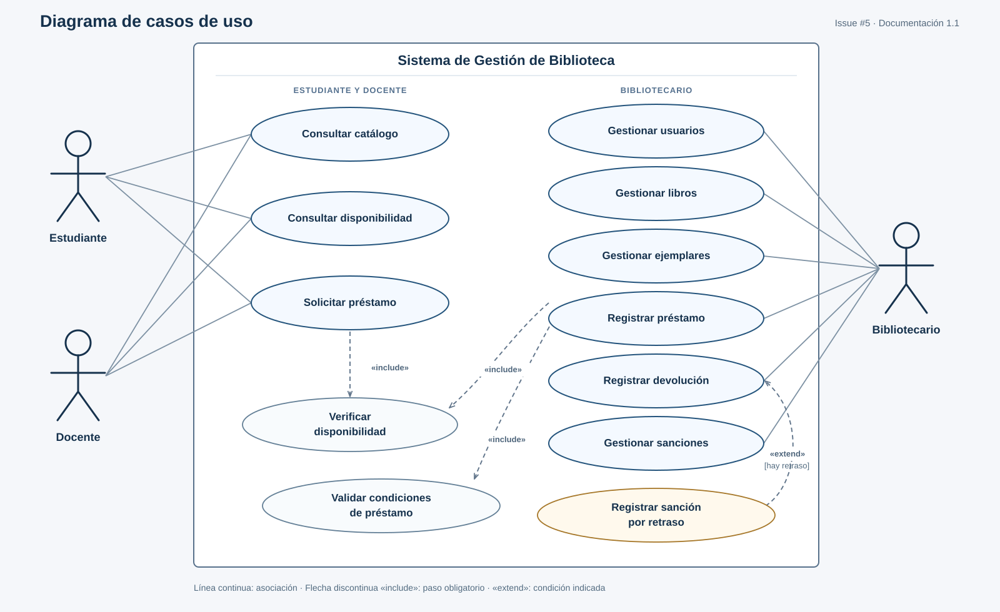

# 1.1 Diagrama de Casos de Uso — Sistema de Gestión de Biblioteca

**Entrega para la [issue #5](https://github.com/EsmeraldaUrbi/Gestion-de-biblioteca/issues/5)**  
Fecha de revisión: 24 de septiembre de 2026

## 1. Alcance y fuentes

El límite del sistema es **Sistema de Gestión de Biblioteca**. Los actores externos son estudiante, docente y bibliotecario. La issue #5 pide representar las funciones de cada uno, incluyendo consulta de catálogo, gestión de usuarios y ejemplares, solicitud de préstamos y registro de devoluciones. El [README del repositorio](https://github.com/EsmeraldaUrbi/Gestion-de-biblioteca/blob/main/README.md) menciona catálogo, ejemplares, usuarios, préstamos, devoluciones y sanciones.

Para conservar coherencia con las tareas vecinas, se consideraron la [issue #6, prototipo UI](https://github.com/EsmeraldaUrbi/Gestion-de-biblioteca/issues/6), la [issue #7, entidad–relación](https://github.com/EsmeraldaUrbi/Gestion-de-biblioteca/issues/7) y la [issue #8, arquitectura](https://github.com/EsmeraldaUrbi/Gestion-de-biblioteca/issues/8). Esta última ubica en la lógica de negocio las validaciones de disponibilidad, límites de préstamos y sanciones por retraso. El repositorio todavía tiene solamente un README; las reglas detalladas aún no están especificadas.

## 2. Actores y funciones

| Actor | Responsabilidad | Casos de uso con asociación directa |
|---|---|---|
| Estudiante | Usuario que busca material y solicita un préstamo. | Consultar catálogo; consultar disponibilidad; solicitar préstamo. |
| Docente | Usuario que busca material y solicita un préstamo. | Consultar catálogo; consultar disponibilidad; solicitar préstamo. |
| Bibliotecario | Personal que mantiene los registros y formaliza las operaciones de préstamo y devolución. | Gestionar usuarios; gestionar libros; gestionar ejemplares; registrar préstamo; registrar devolución; gestionar sanciones. |

Se conectaron estudiante y docente por separado para que los tres actores pedidos sean visibles sin agregar un cuarto actor abstracto. La igualdad de funciones mostradas **no implica** que ambos tengan idénticos límites de préstamo; esos valores siguen sin definirse.

## 3. Casos de uso

| Caso | Actor principal | Resultado o propósito | Origen |
|---|---|---|---|
| Consultar catálogo | Estudiante, docente | Buscar y ver la información de libros. | Issue #5. |
| Consultar disponibilidad | Estudiante, docente | Ver si existe un ejemplar disponible. | Desglose de consulta de catálogo y reglas de issue #8. |
| Solicitar préstamo | Estudiante, docente | Manifestar la intención de obtener un ejemplar disponible. | Issue #5. |
| Gestionar usuarios | Bibliotecario | Mantener los datos de usuarios autorizados. | Issue #5. |
| Gestionar libros | Bibliotecario | Mantener las fichas bibliográficas. | Issue #6 y distinción de issue #7. |
| Gestionar ejemplares | Bibliotecario | Mantener cada copia física y su estado. | Issue #5 y #7. |
| Registrar préstamo | Bibliotecario | Formalizar la salida de un ejemplar a un usuario. | README e issue #6. |
| Registrar devolución | Bibliotecario | Registrar el regreso de un ejemplar. | Issue #5. |
| Gestionar sanciones | Bibliotecario | Consultar y administrar sanciones conforme a reglas pendientes de detalle. | README e issue #7. |
| Verificar disponibilidad | Interno, incluido | Confirmar que el ejemplar puede prestarse en ese momento. | Issue #8. |
| Validar condiciones de préstamo | Interno, incluido | Comprobar límite de préstamos y restricciones por sanciones vigentes. | Issue #8. |
| Registrar sanción por retraso | Condicional durante devolución | Registrar la sanción si la devolución fue tardía. | Issue #8 y entidad Sanción de issue #7. |

**Distinción clave:** «Consultar disponibilidad» muestra información a estudiante o docente; «Verificar disponibilidad» es la comprobación obligatoria de la operación. Consultar no sustituye la validación al registrar el préstamo, porque el estado de un ejemplar puede cambiar.

## 4. Relaciones UML y reglas

| Origen | Relación | Destino | Justificación |
|---|---|---|---|
| Solicitar préstamo | `<<include>>` | Verificar disponibilidad | La solicitud comprueba si el ejemplar puede pedirse. Una solicitud fallida no se transforma en préstamo. |
| Registrar préstamo | `<<include>>` | Verificar disponibilidad | Evita prestar un ejemplar ya ocupado o no prestable. |
| Registrar préstamo | `<<include>>` | Validar condiciones de préstamo | Revisa el límite y las restricciones antes de formalizarlo. |
| Registrar sanción por retraso | `<<extend>>` | Registrar devolución | Solo ocurre cuando la devolución presenta retraso, según la política que se defina. |

En UML, las flechas de `<<include>>` apuntan **al paso obligatorio**; la flecha de `<<extend>>` apunta **al caso base**, «Registrar devolución». El bibliotecario activa la devolución; el registro de la sanción aparece como comportamiento condicional dentro de esa operación. «Gestionar sanciones» representa la tarea administrativa y no ejecuta obligatoriamente «Registrar sanción por retraso» cada vez.

### Flujo resumido

1. Estudiante o docente consulta el catálogo y la disponibilidad de un ejemplar.
2. Solicita el préstamo; el sistema verifica la disponibilidad y puede rechazar la solicitud si no se cumple.
3. El bibliotecario registra el préstamo; el sistema vuelve a verificar disponibilidad y valida límite y restricciones.
4. Al regresar el ejemplar, el bibliotecario registra la devolución.
5. Si hubo retraso, se registra la sanción conforme a una política aún por definir.

El diagrama no dibuja una flecha secuencial entre «Solicitar préstamo» y «Registrar préstamo»: un diagrama de casos de uso describe funciones e interacciones, mientras que el orden del flujo se explica aquí.

## 5. Decisiones y cuestiones abiertas

- **Inicio de sesión:** aparece como pantalla en la issue #6. Se considera una precondición para acciones que requieren identidad; no se repitió como `<<include>>` en cada óvalo, para mantener legible el diagrama. La consulta pública o autenticada debe decidirla el equipo.
- **Cantidad y duración de préstamos, reserva, renovación y multa monetaria:** no están especificadas en las fuentes revisadas. No se afirmaron valores ni se agregaron como requisitos. Si el equipo los incorpora, habrá que actualizar este diagrama.
- **Sanción por retraso:** se representó la condición de retraso porque la issue #8 la menciona, pero no se asume fórmula, duración ni aprobación manual.
- **Libro y ejemplar:** el primero es el registro bibliográfico; el segundo, la copia física prestable. Esa separación coincide con la issue #7.
- **Gestión de usuarios y sanciones:** no se detallan operaciones CRUD individuales porque las issues no definen permisos ni reglas concretas para cada una.

## 6. Comprobación contra la asignación

| Criterio de la issue #5 | Evidencia de cumplimiento |
|---|---|
| Estudiante, docente y bibliotecario | Los tres actores aparecen fuera del límite del sistema. |
| Funciones por actor | Asociaciones explícitas y matriz en la sección 2. |
| Consultar catálogo | Caso conectado a estudiante y docente. |
| Gestionar usuarios y ejemplares | Dos casos conectados al bibliotecario. |
| Solicitar préstamos | Caso conectado a estudiante y docente. |
| Registrar devoluciones | Caso conectado al bibliotecario. |
| Reflejar requisitos funcionales | Préstamos, libros, sanciones y validaciones trazados al README e issues #6–#8. |

## 7. Archivos y forma de entrega

- `diagrama_casos_uso.png`: imagen lista para insertar en la entrega.
- `diagrama_casos_uso.svg`: imagen vectorial editable, la versión visual de referencia.
- `diagrama_casos_uso.puml`: fuente UML textual para modificar o regenerar una versión alternativa con PlantUML; su distribución automática puede variar respecto al SVG.
- `README.md`: análisis, justificación, trazabilidad y decisiones pendientes.

Para incorporarlo al repositorio, crea una carpeta como `docs/casos-de-uso/`, añade estos cuatro archivos, revisa la vista de GitHub y enlaza la carpeta o la imagen en la issue #5. Un cambio en las políticas de préstamo requiere revisar las secciones 4 y 5 antes de cerrar la issue.

**Texto sugerido para comentar en la issue una vez subidos los archivos:**

> Se completó el diagrama de casos de uso del Sistema de Gestión de Biblioteca. Incluye estudiante, docente y bibliotecario; consulta de catálogo y disponibilidad, solicitud y registro de préstamos, gestión de usuarios, libros, ejemplares y sanciones, y registro de devoluciones. Las validaciones de disponibilidad y condiciones del préstamo se modelaron con `<<include>>`; la sanción por retraso, con `<<extend>>`. La imagen y la justificación se encuentran en `docs/casos-de-uso/`.
